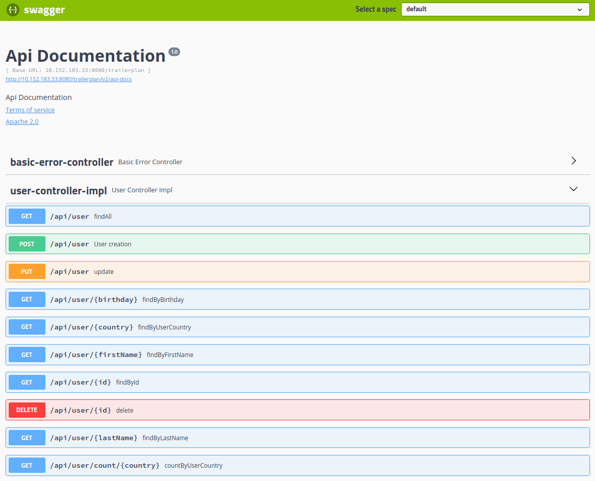
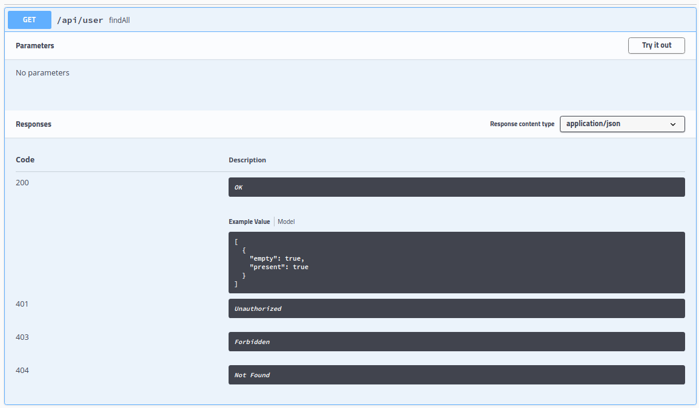
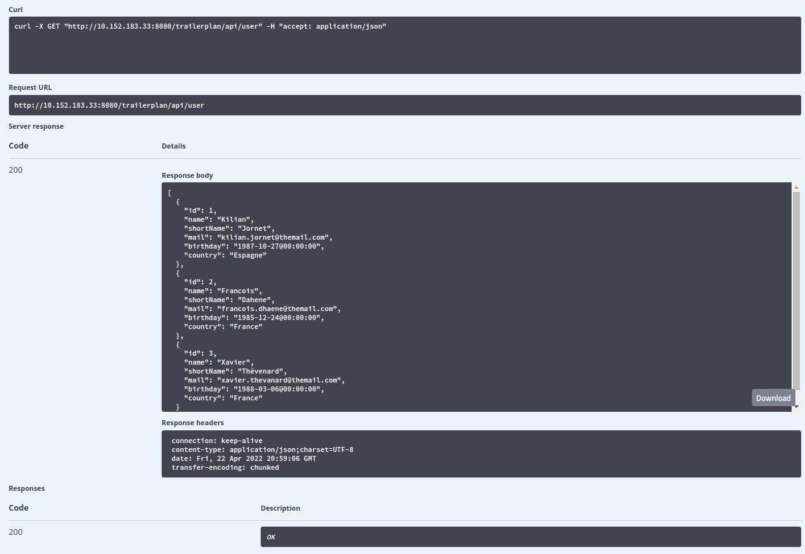

[](https://docs.spring.io/spring-boot/docs/2.1.13.RELEASE/reference/html/)
[](https://hibernate.org/orm/releases/5.4/)
[](https://hibernate.org/validator/releases/6.0/)
[](https://beanvalidation.org/)
[](https://hsql.org)
[](https://maven.apache.org/surefire/maven-surefire-plugin/test-mojo.html)
[](https://maven.apache.org/surefire/maven-failsafe-plugin/integration-test-mojo.html)
[](https://github.com/spotify/dockerfile-maven)
[](https://commons.apache.org/proper/commons-lang/)
[](http://commons.apache.org/proper/commons-lang/)
[](https://dozer.sourceforge.net/)
[](https://www.joda.org/joda-time/)
[](https://github.com/FasterXML/jackson)
[](https://github.com/google/guava/wiki/CollectionUtilitiesExplained)
[](https://hamcrest.org/JavaHamcrest/)
[](https://swagger.io)
[](https://www.docker.com)
[](https://microk8s.io/)
[](https://kubernetes.io/)


# Getting Started

## Abstract
This application is an example of REST api with a containerized spring boot app in 
  a docker image and deploy in a microk8s cluster. 

  It is build on : \
    - OS : [Linux Mint v19](https://www.linuxmint.com) \
    - JDK : [open jdk 11.0.4](https://openjdk.java.net/projects/jdk/11/)


## Features : 
    - rest API for a user : GET, POST, PUT, DELETE
    - unit test for the service layer
    - integration test run with maven failsafe plugin
    - integration test with a memory DB (hsql). The tests are for the layer :
        - repository
        - service
        - controller with spring test mvc
        - controller with rest assured
    - API available in swagger ui at : http://localhost:8080/trailerplan/swagger-ui.html
    - generate the service api for front end development
    - using dozer for mapping : dto <=> entity  
    - validation dto with javax validation
    - search entity with jpa criteria api
    - db schema from hsql-schema.sql and the data hsql-data.sql 
    - build docker images :
        - pull : openjdk:11.0-slim-bullseye
        - with docker-maven-plugin from spotify by profile docker-spotify
        - push to local registry
        - using docker file src/docker/Dockerfile
        - size : 358 mo in my environment 
    - deploy to a local microk8s
        
## Building stage
- checkout the source
- build with : 
    ```
    [user@host:~/user-api]$ mvn clean install
    ```
- run with :
    ``` 
    [user@host:~/user-api]$ java -jar target/user-0.0.1-SNAPSHOT.jar
    ``` 
- check with : 
    - ```[user@host:~/user-api]$ curl http://localhost:8080/trailerplan/api/user/1``` the result is : 
        ```json
        {"id":1,"name":"Kilian","shortName":"Jornet","version":1,"creationDate":"2020-01-20@22:00:00","modificationDate":"2020-01-20@22:00:00","userName":"kjornet","password":"kjornet","mail":"kilian.jornet@themail.com","birthday":"1987-10-26@23:00:00","street":"1 placa Del Sol","zipCode":"17600","city":"Figueras","country":"Espagne"}
        ```
    - in a browser : http://localhost:8080/trailerplan/swagger-ui.html, the swagger api
    
- run integration test : 
    ```
    [user@host:~/user-api]$ mvn clean verify -P integration-test
    ```
    only the integration tests are running, the *IT.java in repository, service and controller layer
    
- run the docker images with : 
  ```
  [user@host:~/user-api]$ docker run --rm --name trailerplan-user-api -p 8080:8080 trailerplan-user-api
  ```
  then all the feature are available from the docker images

- create the namespace with : 
  ```shell
  [user@host:~/user-api]$ kubectl create namespace user-api-ns
  ```

- deploy the app with kubectl :
  ```shell
  [user@host:~/user-api]$ kubectl apply -f container/deployment/user-api-deployment.yaml 
  ```

- display the current deployment object :
  ```shell
  [user@host:~/user-api]$ kubectl get all --namespace user-api-ns
  NAME                                      READY   STATUS    RESTARTS   AGE
  pod/user-api-deployment-bd9c7c95f-qd5ff   1/1     Running   0          75m

  NAME                       TYPE       CLUSTER-IP      EXTERNAL-IP   PORT(S)          AGE
  service/user-api-service   NodePort   10.152.183.33   <none>        8080:32165/TCP   75m

  NAME                                  READY   UP-TO-DATE   AVAILABLE   AGE
  deployment.apps/user-api-deployment   1/1     1            1           75m

  NAME                                            DESIRED   CURRENT   READY   AGE
  replicaset.apps/user-api-deployment-bd9c7c95f   1         1         1       75m
  ```

- display the pod's logs :
```shell
  [user@host:~/user-api] $ kubectl logs pod/user-api-deployment-bd9c7c95f-qd5ff --namespace user-api-ns
```
  ```shell
  .   ____          _            __ _ _
 /\\ / ___'_ __ _ _(_)_ __  __ _ \ \ \ \
( ( )\___ | '_ | '_| | '_ \/ _` | \ \ \ \
 \\/  ___)| |_)| | | | | || (_| |  ) ) ) )
  '  |____| .__|_| |_|_| |_\__, | / / / /
 =========|_|==============|___/=/_/_/_/
 :: Spring Boot ::       (v2.1.13.RELEASE)

22-04-22 Fri 19:56:11.605 INFO  TrailerplanBdMemoryApplication Starting TrailerplanBdMemoryApplication v0.0.1-SNAPSHOT on user-api-deployment-bd9c7c95f-qd5ff with PID 1 (/app/trailerplan-user-api.jar started by root in /app)
22-04-22 Fri 19:56:11.606 INFO  TrailerplanBdMemoryApplication The following profiles are active: dev-local-bd-memory-hsql
22-04-22 Fri 19:56:12.219 INFO  RepositoryConfigurationDelegate Bootstrapping Spring Data JPA repositories in DEFAULT mode.
22-04-22 Fri 19:56:12.256 INFO  RepositoryConfigurationDelegate Finished Spring Data repository scanning in 31ms. Found 1 JPA repository interfaces.
22-04-22 Fri 19:56:12.259 INFO  RepositoryConfigurationDelegate Bootstrapping Spring Data JPA repositories in DEFAULT mode.
22-04-22 Fri 19:56:12.263 INFO  RepositoryConfigurationDelegate Finished Spring Data repository scanning in 4ms. Found 1 JPA repository interfaces.
22-04-22 Fri 19:56:12.263 INFO  RepositoryConfigurationDelegate Bootstrapping Spring Data JPA repositories in DEFAULT mode.
22-04-22 Fri 19:56:12.266 INFO  RepositoryConfigurationDelegate Finished Spring Data repository scanning in 3ms. Found 1 JPA repository interfaces.
22-04-22 Fri 19:56:12.639 INFO  PostProcessorRegistrationDelegate$BeanPostProcessorChecker Bean 'org.springframework.hateoas.config.HateoasConfiguration' of type [org.springframework.hateoas.config.HateoasConfiguration$$EnhancerBySpringCGLIB$$7cc7fff] is not eligible for getting processed by all BeanPostProcessors (for example: not eligible for auto-proxying)
22-04-22 Fri 19:56:12.909 WARN  jsr UT026010: Buffer pool was not set on WebSocketDeploymentInfo, the default pool will be used
22-04-22 Fri 19:56:12.924 INFO  servlet Initializing Spring embedded WebApplicationContext
22-04-22 Fri 19:56:12.924 DEBUG ContextLoader Published root WebApplicationContext as ServletContext attribute with name [org.springframework.web.context.WebApplicationContext.ROOT]
22-04-22 Fri 19:56:12.924 INFO  ContextLoader Root WebApplicationContext: initialization completed in 1289 ms
22-04-22 Fri 19:56:12.946 DEBUG ServletContextInitializerBeans Mapping filters: characterEncodingFilter urls=[/*]
...
  ```

- display the get swagger api in a browser, open the url http://10.152.183.33:8080/trailerplan/swagger-ui.html : 

  
- swagger get all api


- swagger execute the get all api :
